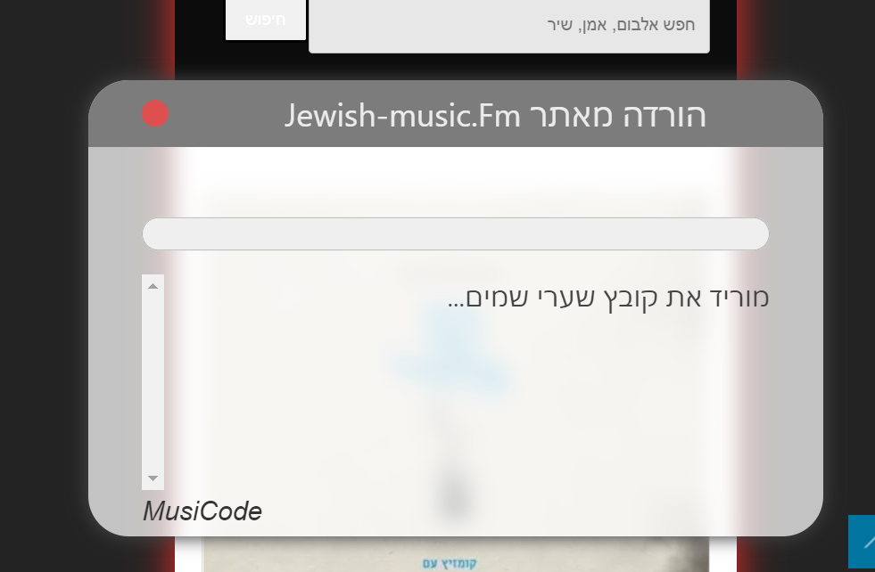

<div dir="rtl">

# הורדת קבצים מ- JewishMusic.FM
פרוייקט זה מאפשר להוריד אלבומים שלמים, מאתר JewishMusic.FM.

הפרוייקט כתוב ב `TypeScript`.

## שימוש
  1. הוסיפו סימנייה חדשה בדפדפן.
  2. העתיקו לתוך הכתובת את הקוד הבא:
  
<div dir="ltr">
  
  ```js
javascript: !function(){"use strict";let e={v:!1};function t(e){const t=document.querySelector("#text");console.log(e),t.innerText+=e+"\n",t.scrollTo({top:t.scrollHeight,behavior:"smooth"})}function o(e){if(0==e)return"0 Byte";var t=Math.trunc(Math.floor(Math.log(e)/Math.log(1024)));return Math.round(e/Math.pow(1024,t))+" "+["Bytes","KB","MB","GB","TB"][t]}window.s=e;var n=function(e){var t=/(%?)(%([jds]))/g,o=Array.prototype.slice.call(arguments,1);return o.length&&(e=e.replace(t,(function(e,t,n,i){var r=o.shift();switch(i){case"s":r=""+r;break;case"d":r=Number(r);break;case"j":r=JSON.stringify(r)}return t?(o.unshift(r),e):r}))),o.length&&(e+=" "+o.join(" ")),""+(e=e.replace(/%{2,2}/g,"%"))};const i="מוריד את קובץ %s...",r="דוחס את קובץ %s...",s="מכין קובץ להורדה...",c="הקובץ מוכן להורדה!",a="מקובץ %s ירדו %s מתוך %s",l="אתר זה, איננו jewishmusic.fm!",d="בדף זה, אין קבצי אודיו!";function u(i,r=0){let s;return new Promise((async(c,l)=>{s=fetch(i.url,{headers:{Range:"bytes=0-"}});const d=await s;if(d.status<200||d.status>=400){if(!(r<5))throw l(),d;r++,t("!!!"),await new Promise((e=>setTimeout(e,1e3))),c(u(i,r))}const w=d.body.getReader(),m=d.headers.get("Content-Length");let h=0;const p=new Response(new ReadableStream({async start(r){const s=setInterval((()=>{t(n(a,i.file_name,o(h),o(m)))}),1e3);for(;;){if(e.v)throw clearInterval(s),r.close(),new Error("window closed!");const{done:t,value:o}=await w.read();if(t){clearInterval(s);break}h+=o.length,r.enqueue(o)}r.close()}}));c(await p.blob())}))}async function w(){const o=document.querySelector("progress"),a=function(){const e=document.querySelectorAll("audio > source");let t=Array.from(e);const o=Array();return t.forEach((e=>{o.push({url:e.src.replace("http://","https://"),file_name:e.parentElement.parentElement.querySelector("h3").innerText})})),o}();let l=new window.JSZip;o.max=a.length;let d=0;for(const s of a){if(e.v)throw new Error("window closed!");t(n(i,s.file_name));const c=await u(s);t(n(r,s.file_name));const a=s.url.split(".").pop();l.file(s.file_name+"."+a,c,{binary:!0}),d++,o.value=d}t(n(s)),await async function(t){const o=document.querySelector(".album-title").innerText,n=document.querySelector(".arts_name").innerText,i=`${o} - ${n}`,r=await t.generateAsync({type:"blob"});if(e.v)throw new Error("window closed!");!async function(e,t){var o=URL.createObjectURL(e),n=document.createElement("a");n.href=o,n.download=t||"download",document.body.appendChild(n),n.click(),n.remove()}(r,i)}(l),t(n(c))}function m(){const t=document.querySelector(".download_from_jewish_music");e.v=!0,t.style.opacity="0",t.style.visibility="hidden",console.log("close window..."),setTimeout((()=>{t.remove()}),3e3)}(window.download_from_jewish_music=async function(){const e=document.querySelector(".download_from_jewish_music");try{console.log("Musicode7"),console.log("https://github.com/MusiCode1/jewish-music.fm"),function(){const e=document.querySelectorAll("audio > source");if("jewishmusic.fm"!==window.location.hostname)throw new Error(l);if(e.length<1)throw new Error(d)}(),e||await async function(){console.log("1");const e=document.createElement("style");e.innerHTML="#window{position:fixed;left:10%;right:10%;top:20%;bottom:20%;max-width:660px;margin:auto;backdrop-filter:blur(8px);border-radius:30px;background:rgba(255, 255, 255, 0.73);box-shadow:0px 0px 13px 1px;transition:all 3s ease-out;z-index:20;}#bar {position:absolute;height:50px;left:0;right:0;background:#7c7c7c;border-radius:30px 30px 0px 0px;}#window-text {height:100%;display:flex;align-items:center;justify-content:space-around;text-align:center;font-size:24px;line-height:28px;color:#ececec;font-family:system-ui;position:relative;width:calc(100% - 60px);}#close {position:absolute;width:20px;height:20px;left:40px;top:15px;background:#de4f4f;border-radius:50%;}#close:hover {background:#f87878;}#window-content {position:relative;top:50px;padding:2em;height:calc(100% - 50px);box-sizing:border-box;}progress {width:100%;height:50px;}#text {font-size:20px;font-family:system-ui;overflow-y:scroll;height:calc(100% - 50px);direction:rtl;}#credit {text-align:left;color:#b6abab;}";const t=document.createElement("div");t.innerHTML='<div id="window" style="visibility:visible; opacity: 1;"><div id="bar"><div id="window-text">הורדה מאתר Jewish-music.Fm</div><div id="close" on:click="window.close()" ></div></div><div id="window-content"><progress value="0" max="1"></progress><div id="text"></div><div id="credit"><a href="https://github.com/MusiCode1/jewish-music.fm" target="_"><em>MusiCode</em></a></div></div></div>',t.classList.add("download_from_jewish_music"),document.body.appendChild(e),document.body.appendChild(t),await new Promise((e=>setTimeout(e,0))),document.querySelector("#close").onclick=m}(),await async function(e){const t=document.createElement("script");t.type="text/javascript",t.src=e,document.head.appendChild(t),await new Promise((e=>t.onload=e))}("https://cdnjs.cloudflare.com/ajax/libs/jszip/3.6.0/jszip.min.js"),await w().finally((()=>{m()}))}catch(e){throw"window closed!"===e.massage?(console.log(e.massage),e):(alert(e),m(),e)}})()}();
  ```
 </div> 
  
  3. פתחו את אתר jewishMusic.FM.
  4. עברו לאלבום כלשהו.
  5. לחצו על הסימנייה והמתינו.

נכתב עבור דיירי דירת 'ניצנים', אשדוד.



## יומן שינויים:
### 0.0.8
 - מחקתי את `Svelte` לחלוטין, על מנת לצמצם את גודל הקוד.</br>
   הקוד כעת באורך 5,123 תווים, כשהאורך המקסימלי של סימנייה הוא 10K תווים.
### 0.0.7
 - עברתי מ- `JavaScript` ל- `TypeScript`.
 - שם השיר הוא כעת בעברית, ולא כפי שהיה מקודם באנגלית.
</div>
